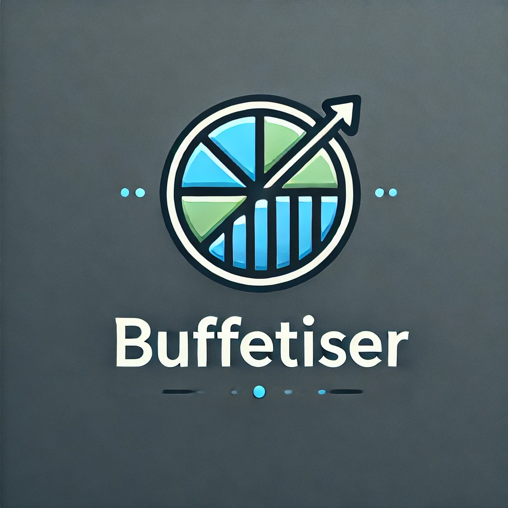
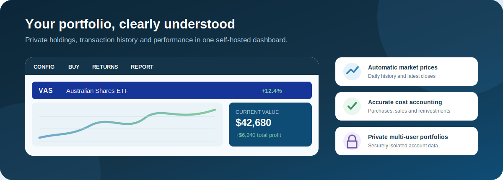
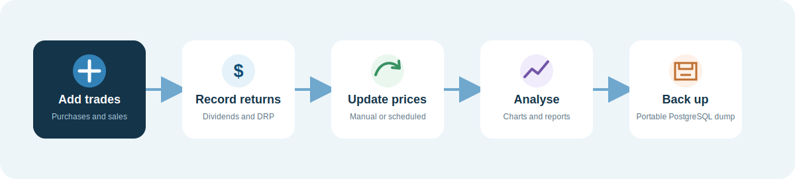
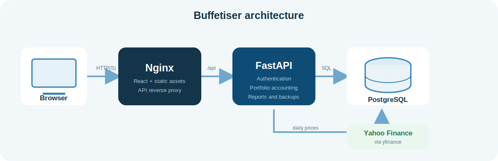

<p align="center">
  
</p>

<p align="center">
  A private, self-hosted investment portfolio tracker for purchases, sales,
  dividends, reinvestments and long-term performance.
</p>

<p align="center">
  <strong>FastAPI</strong> · <strong>React</strong> ·
  <strong>PostgreSQL</strong> · <strong>Docker</strong> ·
  <strong>yfinance</strong>
</p>

> Buffetiser is personal portfolio software, not financial advice. Market data
> may be delayed or incomplete and should be checked against your broker.



## What Buffetiser does

- Tracks share purchases, sales, cash dividends and dividend reinvestments.
- Calculates current units, weighted average cost, unrealised profit and
  realised sale profit.
- Downloads one year of daily price history through `yfinance`.
- Builds individual investment and whole-portfolio performance charts.
- Retains archived investments and their complete transaction history.
- Produces a printable investment transaction report.
- Updates prices manually or automatically at a configured daily time.
- Creates and restores portable PostgreSQL backups using `pg_dump` and
  `pg_restore`.
- Supports multiple users with fully isolated portfolios.
- Uses Argon2 password hashing and HttpOnly session cookies.
- Runs locally, on a home server or on a Synology NAS.

## Interface and workflow



The dashboard contains:

1. A menu for purchases, returns, reports and administration.
2. Expandable cards for each active investment.
3. Price-history charts and current holding statistics.
4. A portfolio totals chart covering the period in which shares were held.
5. A realised-sales chart showing profit per sale and cumulative profit.

## Quick installation with Docker

### Requirements

- [Docker Desktop](https://www.docker.com/products/docker-desktop/) or Docker
  Engine with Compose
- Git
- An internet connection for images, dependencies and market prices

### 1. Get the project

```bash
git clone https://github.com/dodgydesigns/buffetiser-2.0.git buffetiser
cd buffetiser
```

If you downloaded a ZIP instead, extract it and open a terminal in the
extracted directory.

### 2. Configure the environment

```bash
cp .env.example .env
```

Edit `.env` and replace the example database password:

```dotenv
POSTGRES_USER=buffetiser
POSTGRES_PASSWORD=replace-with-a-long-random-password
POSTGRES_DB=BUFFETISER_DB
ALLOWED_ORIGINS=http://localhost,http://127.0.0.1
COOKIE_SECURE=false
SESSION_DAYS=30
```

Do not commit `.env`. It contains your database password.

### 3. Start Buffetiser

```bash
docker compose up -d --build
```

Open [http://localhost](http://localhost).

The first launch displays **Create administrator**. This account owns any data
migrated from an older, single-user installation.

Check container health with:

```bash
docker compose ps
curl http://localhost/health
```

Stop the application without deleting its database:

```bash
docker compose down
```

> Do not add `--volumes` unless you deliberately want to delete the PostgreSQL
> data volume.

## Using Buffetiser

### Add an investment

1. Select **Buy**.
2. Enter the exchange, symbol, investment name and purchase details.
3. Save the purchase.

For a newly added share, Buffetiser downloads approximately one year of daily
history and uses the latest close as its live price.

### Record a sale

1. Expand the investment card.
2. Select **Sell**.
3. Enter the units, price, fee and trade date.

Sales use the weighted average cost of the units available on the sale date.
Backdated purchases and reinvestments automatically recalculate later realised
profits.

### Record returns

Use **Returns** in the menu bar:

- **Dividends** records a cash payment for reports without changing units or
  cost.
- **Reinvestment** adds units at the supplied price and updates the holding's
  cost statistics.

### View reports

Select **Report** to view purchases, sales, dividends and reinvestments,
including transactions belonging to archived investments.

### Archive an investment

Expand its card and select **Remove**. After confirmation, the investment is
hidden from the active dashboard but its transactions remain in the database
and reports.

### Update prices

Administrators can open **Config → Administrator** to:

- update all active share prices immediately;
- choose the daily automatic update time;
- back up the database; or
- restore a previous backup.

### Create another user

Administrators can select **Config → New User**. Every account has a separate
portfolio: users cannot read, sell, archive or report on another user's
investments.

Select your display name in the menu bar to change your password.

## Backup and restore

Open **Config → Administrator**:

- **Back up** creates a PostgreSQL custom-format dump and lets the browser save
  it.
- **Restore** accepts a `.dump` or `.backup` file and replaces the current
  database.

Before restoring, Buffetiser creates an internal safety backup. If the restore
fails, it attempts to recover the original database automatically.

Keep exported backups somewhere outside the application directory, ideally
with another copy on separate storage.

## Synology NAS

Buffetiser includes a dedicated
[`docker-compose.synology.yml`](docker-compose.synology.yml).

The short version:

1. Install **Container Manager** in DSM.
2. Copy the repository to `/volume1/docker/buffetiser`.
3. Create `.env` from `.env.example`.
4. Set `ALLOWED_ORIGINS` to the NAS address, for example
   `http://192.168.1.50:8080`.
5. Create a Container Manager project using
   `docker-compose.synology.yml`.
6. Open `http://NAS-IP:8080`.

See [the complete Synology guide](docs/SYNOLOGY.md) for HTTPS, reverse proxy,
updates and migration instructions.

### Synology rebuild and disaster recovery

Once Buffetiser is working on Synology, create a fresh backup from
**Config → Administrator → Back up** and store it outside
`/volume1/docker/buffetiser`. That backup is the easiest way to recover your
portfolio if the NAS project or database volume is ever removed.

The Synology Compose file is enough to recreate the application as long as the
project files are present:

```bash
cd /volume1/docker/buffetiser
sudo docker compose -f docker-compose.synology.yml up -d --build
```

Deleting containers or images is safe; Docker can rebuild them. Deleting the
database volume removes the portfolio data:

```bash
# Stops containers but keeps the database volume.
sudo docker compose -f docker-compose.synology.yml down

# Dangerous: also deletes the PostgreSQL data volume.
sudo docker compose -f docker-compose.synology.yml down -v
```

If you deliberately start from nothing:

1. Copy the Buffetiser project back to `/volume1/docker/buffetiser`.
2. Create `.env` from `.env.example` and set the NAS address in
   `ALLOWED_ORIGINS`, for example `http://192.168.1.50:8080`.
3. Start the project with `docker-compose.synology.yml`.
4. Create the administrator account.
5. Restore your latest `.dump` backup through **Config → Administrator**.

## Security

- Passwords are hashed with Argon2.
- Login sessions use random tokens stored as hashes in PostgreSQL.
- Browser sessions use HttpOnly, SameSite cookies.
- Portfolio queries and mutations are scoped to the authenticated owner.
- Backup, restore, user creation and scheduling are administrator-only.
- PostgreSQL is not published to the host network.

For access outside your home network, use a private VPN such as Tailscale.
Do not expose Buffetiser directly through router port forwarding.

When serving Buffetiser through HTTPS, set:

```dotenv
COOKIE_SECURE=true
ALLOWED_ORIGINS=https://buffetiser.example.com
```

Then rebuild the project.

## Architecture



| Component | Technology | Purpose |
| --- | --- | --- |
| Frontend | React, TypeScript, Material UI, Recharts | Dashboard and dialogs |
| Web server | Nginx | Static files and `/api` reverse proxy |
| Backend | FastAPI, SQLModel | API, accounting and authentication |
| Database | PostgreSQL 16 | Users, transactions, settings and prices |
| Migrations | Alembic | Versioned database schema changes |
| Market data | yfinance | Daily close and historical price data |

## Development

### Backend

```bash
python3 -m venv .venv
source .venv/bin/activate
pip install -r backend/requirements.txt -r backend/requirements-dev.txt
pytest -q
ruff check backend
```

### Frontend

```bash
cd frontend
npm ci
npm run lint
npx tsc --noEmit
npm run build
```

### Database migrations

The backend applies migrations automatically when its container starts.

Useful development commands:

```bash
./scripts/db.sh upgrade head
./scripts/db.sh revision --autogenerate -m "describe the change"
./scripts/db.sh downgrade -1
```

### Project structure

```text
backend/
  alembic/           Database migrations
  app/business/      Portfolio accounting rules
  app/core/          API-facing application services
  app/models/        SQLModel database models
  tests/             Backend test suite
frontend/
  src/components/    React UI
  nginx.conf         Production reverse proxy
docs/
  SYNOLOGY.md        Synology installation guide
docker-compose.yml   Local Docker stack
```

## Troubleshooting

### The page remains on Loading

```bash
docker compose ps
docker compose logs --tail=100 backend
curl http://localhost/health
```

### A share does not update

Check that its exchange and symbol match Yahoo Finance. Australian Securities
Exchange symbols use the `.AX` Yahoo suffix automatically.

### Port 80 is already in use

Change the frontend mapping in `docker-compose.yml`, for example:

```yaml
ports:
  - "127.0.0.1:8080:80"
```

Then use `http://localhost:8080` and add that address to `ALLOWED_ORIGINS`.

### Resetting the installation

This permanently removes the database:

```bash
docker compose down --volumes
```

Create and verify a backup first.

## Licence

Buffetiser is released under the
[Apache License 2.0](LICENSE).
